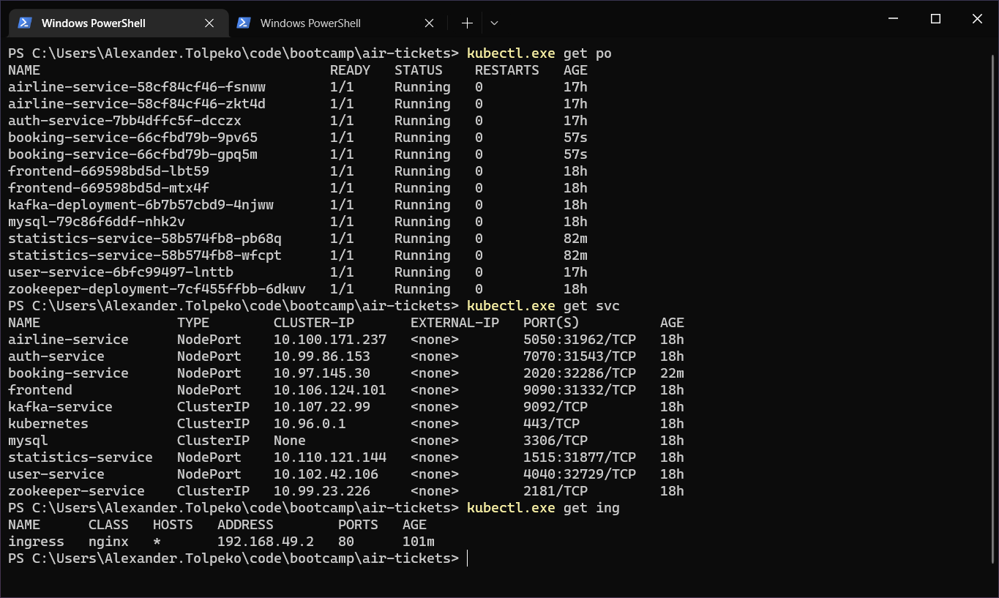
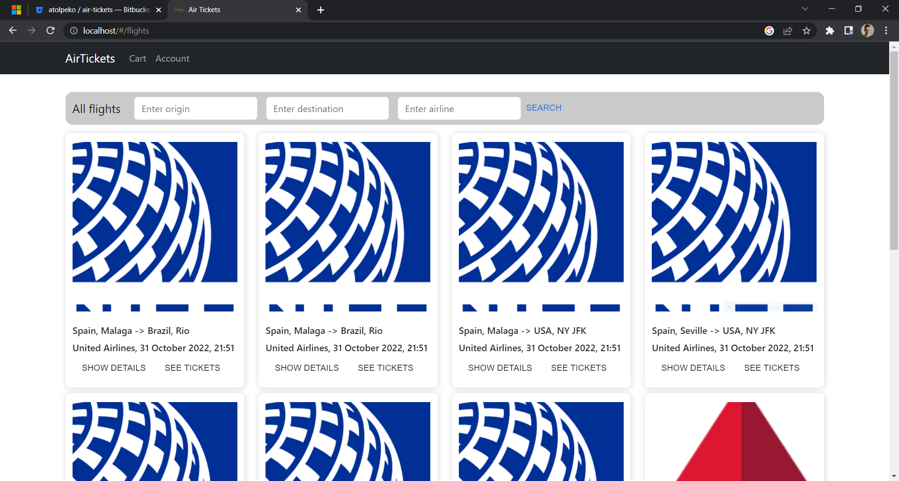
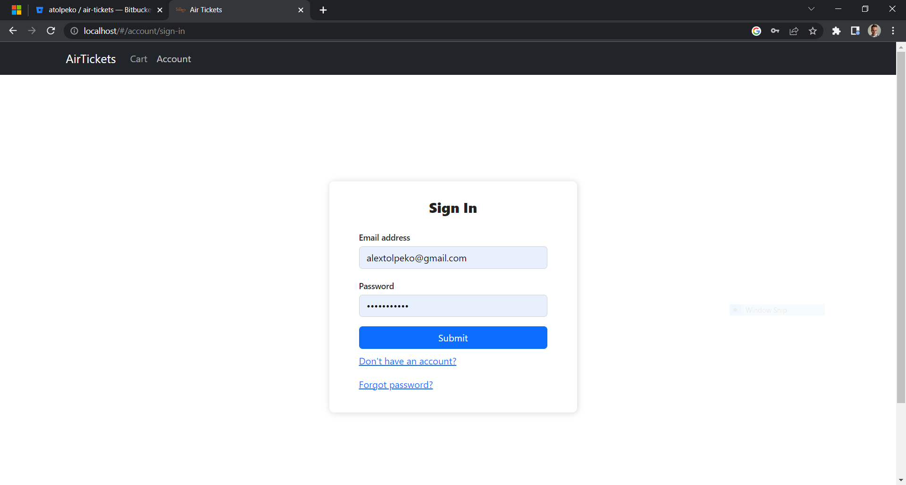

# air-tickets

[](https://opensource.org/licenses/Apache-2.0)

**Backend stack:** Java SE, Spring Framework, Apache Tomcat, Jackson, Maven, JUnit,
Mockito, MySQL, H2, Hibernate, Docker, Kubernetes, Jenkins, Kafka.

**Frontend stack:** JavaScript, React, HTML, CSS.

## Build

### Build the frontend

Build the React frontend application using [npm](https://docs.npmjs.com/downloading-and-installing-node-js-and-npm).
```
cd frontend
npm install
npm run build
cd ..
```
### Build the backend

At first, make sure that [Docker](https://www.docker.com/) daemon is running.
Login to the Docker Hub with the following credentials:
```
docker login -u airtickets -p air-tickets8080
```

Then, run [Maven](https://maven.apache.org/). It will build a Docker image for each microservice
and push it to the remote Docker repository.
```
mvn clean deploy
```
> Note: If the deployment fails, run `mvn clean install` and manually push all built images.

## Run locally

You can spin up the Kubernetes deployment locally using [Minikube](https://minikube.sigs.k8s.io/docs/start/).
Give the `minikube_run` shell script the right to execute and run it.
```
chmod +x deployment/minikube_run.sh
./deployment/minikube_run.sh
```
Now you can access the application on http://localhost/

## Use

Airtickets lets you work with airlines, flights, tickets and tickets. It declares 2 user roles: admins and users.
It's fully secured - e.g., only a user that created an airline can edit it's data and create flights and tickets
for this airline, a user can log in only to his personal account, only administrators can see statistics and so on.
<br>
Airtickets provides one pre-assigned administrator with the following credentials:
```
email: airadmin@gmail.com
password: jkhfdjk2323766
```

## Public API
All the endpoints follow the REST API Resource naming conventions.

#### Users:

* HTTP GET http://localhost/users?email=... - get the user registered with the specified email (autentication required)
* HTTP POST http://localhost/users - register a new user
* HTTP PATCH http://localhost/users?email=... - edit the user registered with the specified email (autentication required)
* HTTP DELETE http://localhost/users?email=... - delete the user registered with the specified email (autentication required)

#### Autentication:

* HTTP POST http://localhost/oauth/token - obtain an OAuth2 token

#### Airlines:

* HTTP GET http://localhost/airlines - get all airlines
* HTTP GET http://localhost/airlines/{id} - get the airline with the specified ID
* HTTP GET http://localhost/airlines?name=... - get the airline with the specified name
* HTTP POST http://localhost/airlines - create a new airline (autentication required)
* HTTP PATCH http://localhost/airlines/{id} - edit the airline with the specified ID (autentication required)
* HTTP DELETE http://localhost/airlines/{id} - delete the airline with the specified ID (autentication required)

#### Flights:

* HTTP GET http://localhost/flights - get all flights
* HTTP GET http://localhost/flights/{id} - get the flight with the specified ID
* HTTP GET http://localhost/flights?airlineId=... - get all flights with the specified airline ID
* HTTP GET http://localhost/flights?airlineName=... - get all flights with the specified airline name
* HTTP GET http://localhost/flights?origin=...&destination=... - get all flights with the specified origin and destination
* HTTP GET http://localhost/flights?origin=...&destination=...&airline=... - get all flights with the specified origin, destination
and airline name
* HTTP POST http://localhost/flights - create a new flight (autentication required)
* HTTP PATCH http://localhost/flights/{id} - edit the flight with the specified ID (autentication required)
* HTTP DELETE http://localhost/flights/{id} - delete the flight with the specified ID (autentication required)

#### Tickets:

* HTTP GET http://localhost/tickets - get all tickets
* HTTP GET http://localhost/tickets/{id} - get the ticket with the specified ID
* HTTP GET http://localhost/tickets?flight... - get all tickets with the specified flight ID
* HTTP GET http://localhost/tickets?flight...&price=... - get all tickets with the specified flight ID
which price is lower that or equal to the specified price
* HTTP GET http://localhost/tickets?flight...&luggageAllowed=... - get all tickets with the specified flight ID
which allow luggage
* HTTP POST http://localhost/tickets - create a new ticket (autentication required)
* HTTP DELETE http://localhost/tickets/{id} - delete the ticket with the specified ID (autentication required)

### Bookings:

* HTTP GET http://localhost/booking - get all bookings (autentication required)
* HTTP GET http://localhost/booking/{id} - get a booking with the specified ID (autentication required)
* HTTP POST http://localhost/booking - create a new booking (autentication required)
* HTTP DELETE http://localhost/booking/{id} - delete a booking with the specified ID (autentication required)

### Statistics:
* HTTP GET http://localhost/statistics/order - get order statistics (autentication required)

## Screenshots

#### Kubernetes deployment:


#### Jenkins build:


#### Flights:



#### Tickets:


#### Account:



#### Cart:


#### Order:


